# DevConnector

基于react express mongodb技术

## 基本功能

- [x] 开发者总览
- [x] 开发者个人信息：链接获取github仓库
- [x] 简介/经历/教育 增删改查
- [x] 社区留言，回复留言
- [x] 登录/注册/退出

## 页面预览

### 开发者总览

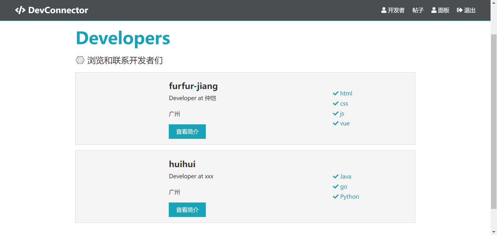

### 开发者个人信息：链接获取github仓库

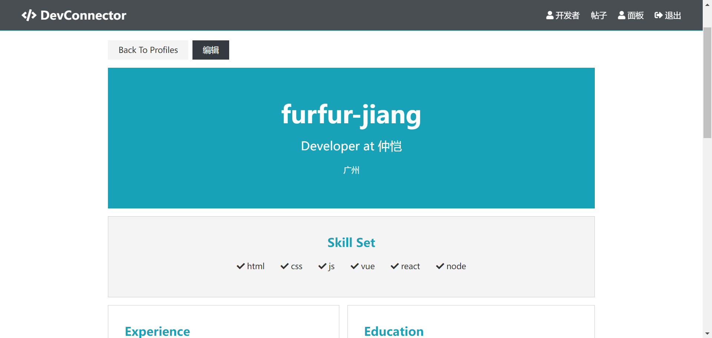

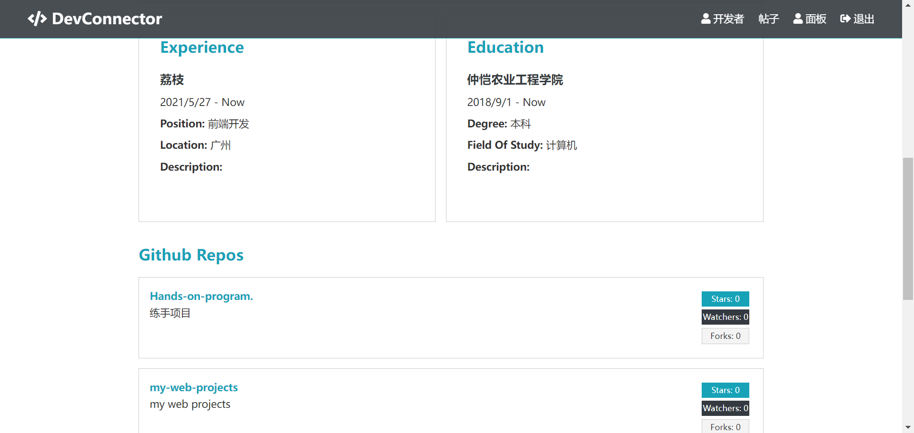

### 简介/经历/教育 增删改查

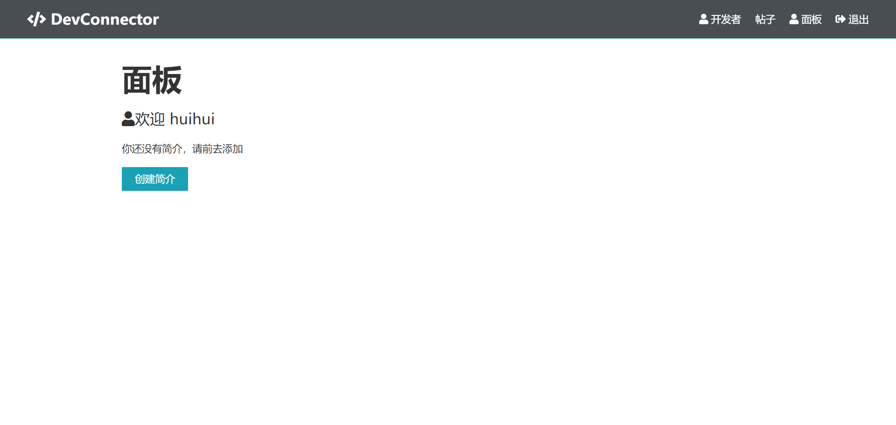

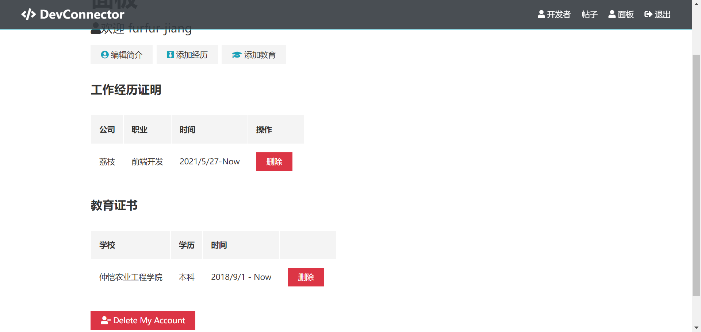

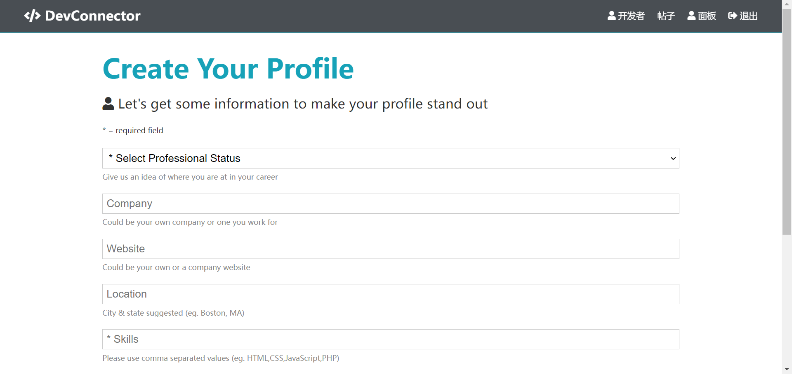

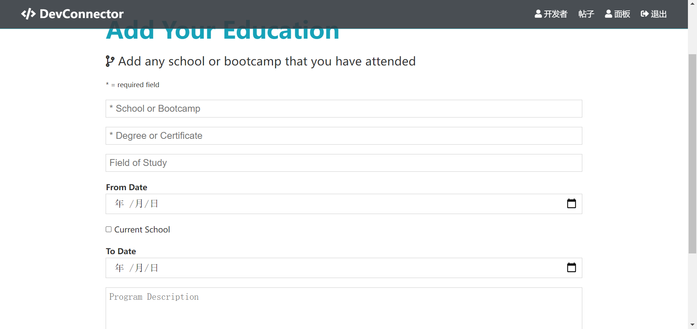

### 社区留言

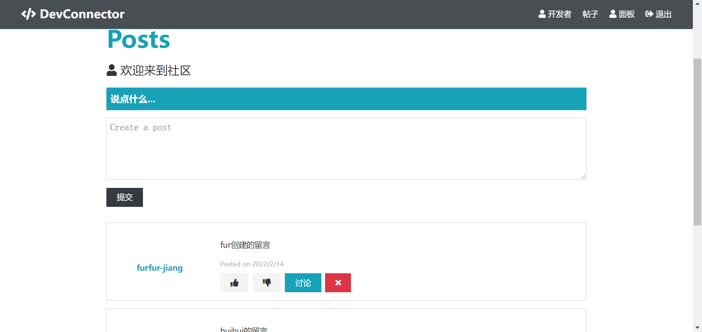

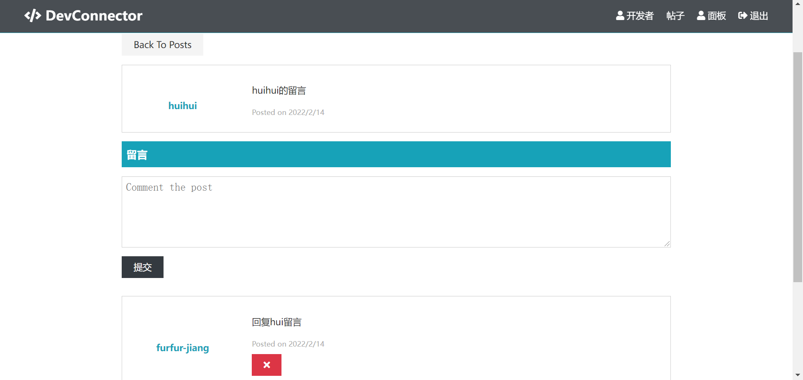

### 登录/注册

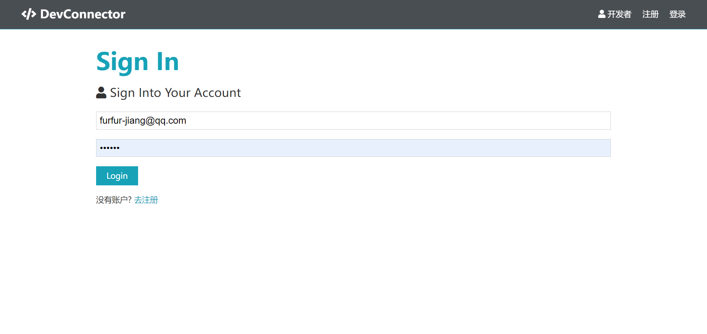

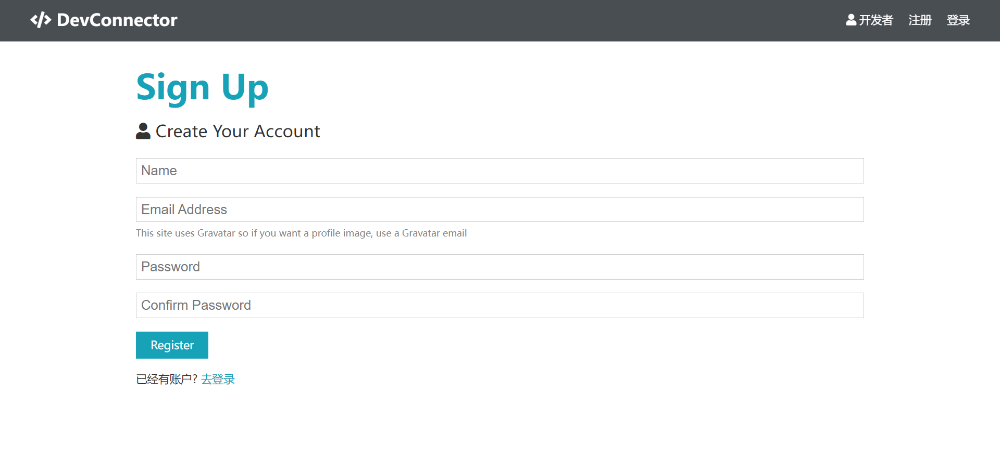

## 快速启动

npm install

npm run dev

服务端在5000，客户端3000

预览地址 : http://localhost:3000/profiles

## 部署到HEROKU

预览：https://pure-beyond-79677.herokuapp.com/profiles

